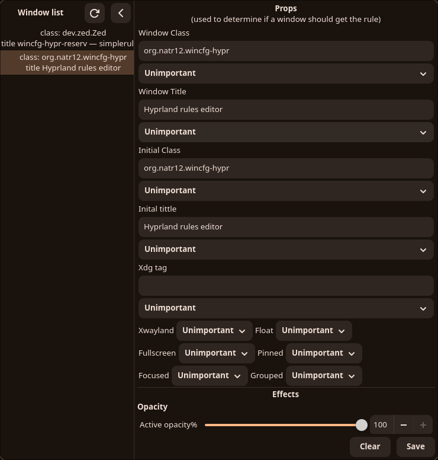

App for creating and editing window rules in hyprland. Written in c++ and gtkmm 4

**Features**
* Creating new rules
* Editing existing rules
* Removing rules
* Working with named rules
* Getting window properties from `hyprctl clients`
* For floating windows, getting its size and position

**Limitations (temporarily):**
* Not all rule types are implemented (in development).

This app uses a separate file to store window rules. You need to include it in your Hyprland config:
```
source = windowrules.conf
```
## Compilation
```
./run.sh
```
---
## Screenshot


